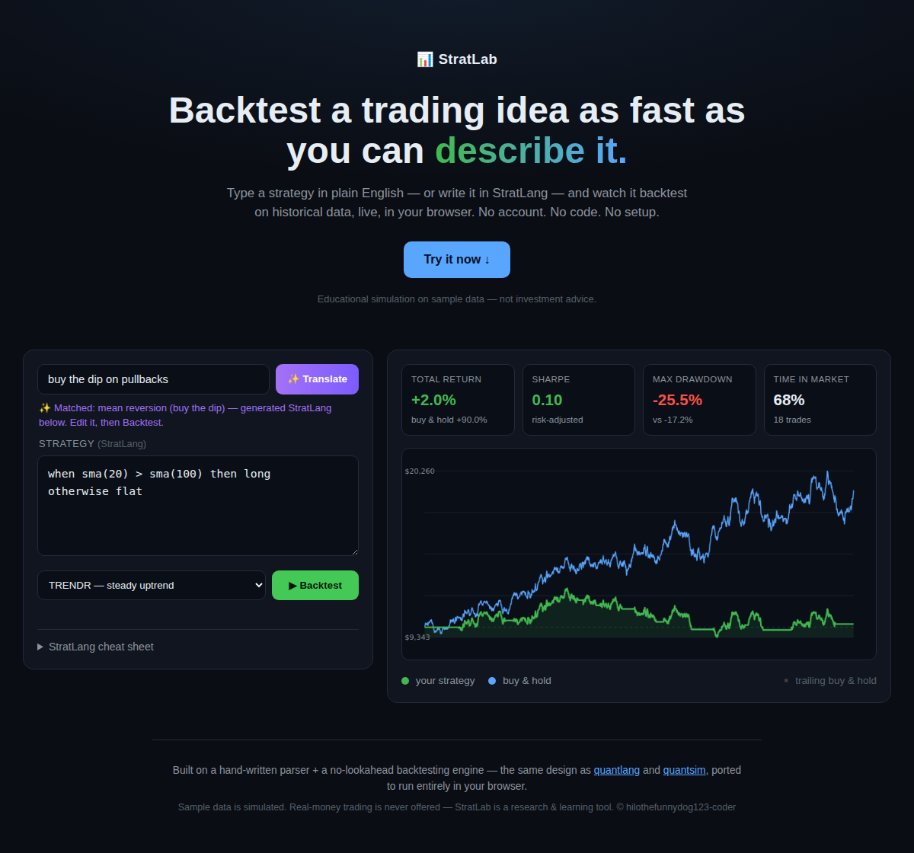

# 📊 StratLab

**Backtest a trading idea as fast as you can describe it.**

Type a strategy in plain English — *"buy the dip"*, *"momentum"*, *"golden cross"* — or write it in **StratLang**, and watch it backtest on historical data **live, in your browser**. No account, no code, no setup, no backend. Just an idea in, an equity curve out.

👉 **[Try the live demo](https://hilothefunnydog123-coder.github.io/stratlab/)**



## Why

Algorithmic backtesting is locked behind Python, pandas, and a data pipeline. Millions of retail traders have strategy *ideas* and no way to test them without either risking money or learning to code. StratLab collapses that to one sentence:

> *"buy the dip"* → a real backtest with Sharpe, drawdown, and a vs-buy-&-hold equity curve, in under a second.

The wedge is the **readable language**: a strategy is `when sma(20) > sma(100) then long`, not 40 lines of pandas. That's the hook, the moat, and the reason it can go viral.

## What it does

- **Plain-English → strategy.** Describe an idea; StratLab generates editable StratLang.
- **Instant in-browser backtest.** A hand-written parser + a **no-lookahead** backtesting engine (the same design as [quantlang](https://github.com/hilothefunnydog123-coder/quantlang) and [quantsim](https://github.com/hilothefunnydog123-coder/quantsim)), ported to pure JavaScript — runs entirely client-side.
- **Honest results.** Transaction costs are on, buy & hold is always the benchmark, and the engine never peeks at the future. If your idea loses, StratLab tells you — that's the point.
- **Real diagnostics.** Compile errors point at the line with *did-you-mean* suggestions.

## StratLang in 20 seconds

```
when momentum(126) > 0 and rsi(14) > 75  then flat     # overheated → step aside
when momentum(126) > 0                   then long     # else ride the trend
otherwise flat
```

Rules read top-down, first match wins, `otherwise` is required. Actions are `long` / `short` / `flat` / any weight (`0.5` = half invested). Indicators: `price`, `sma`, `ema`, `rsi`, `momentum`, `highest`, `lowest`, `volatility`.

## Run it

It's a static site — no build, no server:

```bash
git clone https://github.com/hilothefunnydog123-coder/stratlab.git
cd stratlab && python3 -m http.server   # open http://localhost:8000
```

Deploy anywhere static (GitHub Pages, Vercel, Netlify) by pointing it at the repo root.

## Architecture

| Piece | File | Notes |
|---|---|---|
| Lexer + recursive-descent parser | `engine.js` | Real operator precedence, position-tracked errors |
| No-lookahead backtester | `engine.js` | Weight from data through *t* earns return *t→t+1*; turnover costs |
| Plain-English translator | `translate.js` | Deterministic intent matcher — **an LLM slots in here in production** (one function) |
| UI + canvas chart | `app.js` | Zero dependencies |

## Roadmap

- [ ] Real market data (swap the sample series for a data API)
- [ ] LLM-powered translation for open-ended descriptions
- [ ] Options mode — IV rank, expected move & Greeks from [optionslab](https://github.com/hilothefunnydog123-coder/optionslab)
- [ ] Save & share a strategy by URL
- [ ] One-click paper-trade (via [quantsim](https://github.com/hilothefunnydog123-coder/quantsim) live)

## A note on scope

StratLab is a **research and learning tool**. It runs on sample data and never offers real-money trading — deliberately. The moment a product custodies user funds it inherits a mountain of regulation; StratLab stays on the education/simulation side of that line on purpose.

## License

MIT
